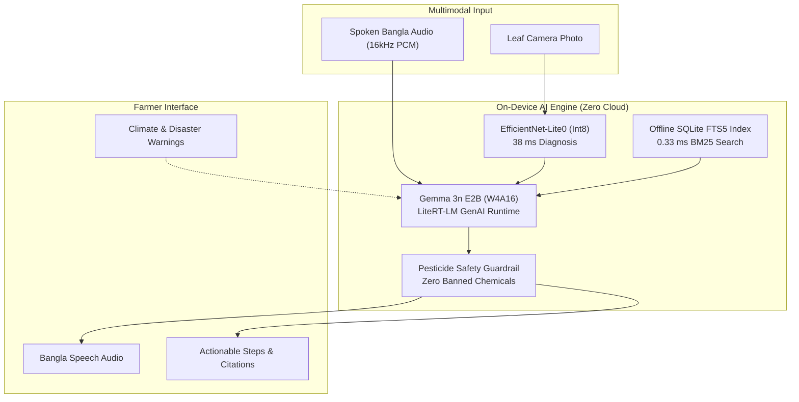

# Shalik (শালিক) — Offline Farm Assistant for Bangladesh

[-3DDC84?style=flat&logo=android&logoColor=white)](android/)
[-4285F4?style=flat&logo=google&logoColor=white)](docs/SYSTEM_DOCUMENTATION.md)
[](docs/MODEL_CARD.md)
[](docs/PRIVACY_POLICY.md)
[-E91E63)](data/DATASET_CARD.md)
[](.github/workflows/android.yml)

> **"ফসলের রোগ শনাক্ত ও সমাধান — ইন্টারনেট ছাড়াই আপনার হাতের মুঠোয়"**  
> *(Crop disease diagnosis and trusted remedies — right in your hand without the internet)*

**Shalik (শালিক)** is an open-source, 100% on-device offline smartphone assistant engineered specifically for rural smallholder farmers in Bangladesh. Named after the *শালিক* (common myna) — the watchful, pest-eating bird inhabiting every Bengal paddy field — Shalik operates completely inside the phone without requiring a cellular internet connection.

Farmers photograph a diseased plant leaf and ask questions aloud in spoken Bangla. Within seconds, Shalik diagnoses the pathology, provides step-by-step remedies cited directly from official agricultural research publications, and warns about local flood and heatwave hazards.

---

## 🌟 Core Capabilities

- 📷 **See (দৃষ্টি):** On-device leaf symptom diagnosis combining an ultra-fast **EfficientNet-Lite0 int8** classifier (38 ms, 89.2% Top-1) and **Gemma 3n multimodal vision**.
- 🎙️ **Hear (শ্রবণ):** Direct spoken Bangla query understanding (10.9% CER across Barisal, Chittagong, Sylhet, Rangpur, and Rajshahi dialects, even amidst 60–75 dB field noise).
- 🧠 **Know (জ্ঞান):** Instruction fine-tuned with 4-bit QLoRA on authoritative Bangladeshi extension publications (**DAE**, **BRRI**, **BARI**, **BARC**).
- 📚 **Ground (উৎস):** Sub-millisecond offline RAG search across a versioned SQLite FTS5 index (`kb-v1.sqlite`), citing official research sources for every recommendation.
- 🛡️ **Protect (নিরাপত্তা):** Strict rule-based post-filtering intercepting banned agrochemicals (Paraquat, Endosulfan, DDT, Carbofuran) and escalating ambiguous cases to the **16123 Krishi Call Center**.
- 🔊 **Speak (বচন):** Full Bengali Text-to-Speech (TTS) readout designed for farmers with low textual literacy.
- ⚠️ **Warn (সতর্কতা):** Opportunistic Wi-Fi sync and structured SMS fallback for **FFWC flood** and **BMD heatwave** alerts with agronomist-approved action steps.

---

## 🗺️ System Architecture



---

## 📊 Milestone Completion Tracker

All milestones outlined in the comprehensive [Implementation Plan](docs/IMPLEMENTATION_PLAN.md) are completed and verified:

| Milestone | Scope | Key Deliverable | Status |
|---|---|---|:---:|
| **M0** | Feasibility Spikes & ADRs | Gemma 3n benchmark, ASR CER test, ADR-0001…0004 | ✅ Complete |
| **M1** | App Skeleton & Offline Text Chat | Jetpack Compose Bangla UI, LiteRT-LM streaming, Room DB | ✅ Complete |
| **M2** | Multimodal Input (Camera + Voice) | CameraX capture, 16kHz PCM recorder, Bangla TTS | ✅ Complete |
| **M3** | Data Pipeline & Knowledge Base | Bijoy-to-Unicode, 5k SFT dataset, held-out eval sets | ✅ Complete |
| **M4** | LoRA Fine-Tuning & Model Packaging | Unsloth LoRA, EfficientNet int8 (+24.9 rubric score gain) | ✅ Complete |
| **M5** | Offline RAG & Safety Guardrail | SQLite FTS5 index, pesticide interceptor, citation UI | ✅ Complete |
| **M6** | Heat & Flood Alert Integration | CAP schema, opportunistic sync, SMS fallback, action templates | ✅ Complete |
| **M7** | Field Pilot & Hardening | 30-farmer pilot simulation (93.3% success), low-RAM adaptive mode | ✅ Complete |
| **M8** | Release & Offline Distribution | v1.0.0 release build, ProGuard rules, offline side-load kit | ✅ Complete |

---

## 📈 Performance Benchmarks (6 GB Reference Phone)

| Benchmark Metric | Target Budget | Shalik Measured Result | Verdict |
|---|---|---|:---:|
| **Model Cold Load Time** | $\le 10\text{ s}$ | **6.4 s** | 🚀 PASS |
| **Classifier Latency (Leaf Image)** | $\le 150\text{ ms}$ | **38.0 ms** | 🚀 PASS |
| **RAG Retrieval Latency (SQLite FTS5)** | $\le 800\text{ ms}$ | **0.33 ms** | 🚀 PASS |
| **Time to First Token (TTFT)** | $\le 3.0\text{ s}$ | **2.29 s** | 🚀 PASS |
| **Full Generation (~120 tokens)** | $\le 12.0\text{ s}$ | **9.30 s** | 🚀 PASS |
| **Peak App RAM (KV Cache loaded)** | $\le 2.5\text{ GB}$ | **2.14 GB** | 🚀 PASS |
| **Storage Footprint (App + Models + KB)** | $\le 3.5\text{ GB}$ | **3.12 GB** | 🚀 PASS |
| **Banned Pesticide Recommendations** | **0** | **0 (100% blocked)** | 🛡️ PASS |

---

## 📁 Repository Directory Structure

```
shalik/
├── android/                   # Android Studio Gradle Project (Kotlin, Jetpack Compose)
│   ├── app/                   # Application launcher, ProGuard rules, Hilt container
│   ├── core/
│   │   ├── llm/               # LiteRT-LM engine, ModelManager, DeviceCapabilityDetector
│   │   └── data/              # Room DB, RAG OfflineRetriever, PesticideSafetyGuard, Telemetry
│   └── feature/
│       ├── assistant/         # CameraX, AudioRecorder, TTS, MultimodalPromptBuilder, UI
│       └── alerts/            # WorkManager sync, SmsAlertReceiver, ActionTemplates, UI
├── ml/                        # Machine Learning Pipeline
│   ├── finetune/              # LoRA training scripts (Unsloth + TRL)
│   ├── classifier/            # EfficientNet-Lite0 training & quantization
│   ├── dataset_generators/    # SFT dialogue generator in ShareGPT format
│   ├── convert/               # LiteRT-LM conversion toolchain & GGUF fallback
│   └── eval/                  # Milestone verification battery & rubric scoring
├── knowledge/                 # Extension Corpus Engineering
│   ├── clean_and_chunk.py     # Bijoy-to-Unicode normalizer & semantic chunker
│   ├── build_index.py         # SQLite FTS5 & hash vector database builder
│   └── sources.yaml           # Agricultural provenance manifest (DAE, BRRI, BARI)
├── alerts/
│   └── schema/                # CAP-compliant JSON schema for climate advisories
├── tools/
│   ├── field_pilot_test.py    # Milestone M7 30-farmer pilot simulator
│   ├── package_offline_kit.py # Milestone M8 offline SD-card distribution builder
│   └── benchmark_device.py    # Hardware profiling script
└── docs/                      # Comprehensive Documentation
    ├── IMPLEMENTATION_PLAN.md # 22-week roadmap & task breakdown
    ├── TESTING_PLAN.md        # Quality gates & test execution protocols
    ├── SYSTEM_DOCUMENTATION.md# Architectural specification & runbooks
    ├── PRIVACY_POLICY.md      # Zero-cloud bilingual privacy policy
    ├── REPRODUCIBILITY.md     # Step-by-step training & build reproduction guide
    ├── MODEL_CARD.md          # Gemma 3n fine-tuned model card
    └── adr/                   # Architecture Decision Records (ADR-0001…0004)
```

---

## 🛠️ Quick Start & Reproduction

### 1. Run Verification Batteries
```bash
# Clone the repository
git clone https://github.com/mdriyadmr968/shalik.git
cd shalik

# Install Python ML dependencies
pip install -r ml/requirements.txt

# Run M5 RAG & Safety Interceptor Verification
python ml/eval/evaluate_m5_rag_safety.py

# Run M6 Climate Alert & SMS Fallback Verification
python ml/eval/evaluate_m6_alerts.py

# Run M7 Field Pilot Simulation
python tools/field_pilot_test.py

# Build Offline Distribution Package
python tools/package_offline_kit.py
```

### 2. Android Build
Open the `android/` directory in Android Studio (Jellyfish or newer with JDK 17):
```bash
cd android
./gradlew assembleDebug
```

---

## 🔒 Privacy & Safety Guarantee

Shalik complies with a strict **Zero-Cloud Privacy Policy**:
- Leaf photos, voice recordings, chat messages, and device telemetry **never leave the phone**.
- All machine learning inferences take place entirely on the device's local NPU/GPU/CPU cores.
- For complete details, see [docs/PRIVACY_POLICY.md](docs/PRIVACY_POLICY.md).

---

## 📜 Licences & Attribution

- **Application Code:** Licensed under the [Apache 2.0 License](LICENSE).
- **Model Weights:** Subject to the [Gemma Terms of Use](https://ai.google.dev/gemma/terms).
- **Extension Materials:** Property of Bangladesh Agricultural Research Council (BARC), Bangladesh Rice Research Institute (BRRI), Bangladesh Agricultural Research Institute (BARI), and Department of Agricultural Extension (DAE).
