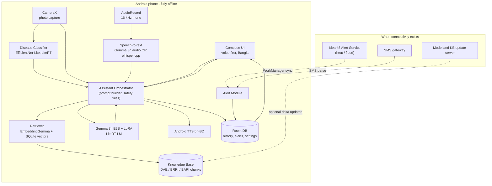
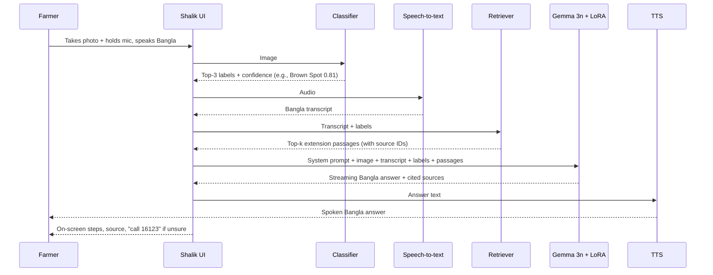
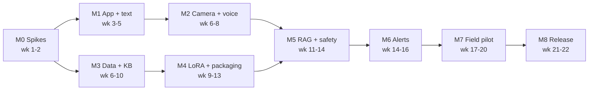

# Shalik (শালিক) — Implementation Plan

> **Offline farm assistant on a phone.** A farmer photographs a crop problem and asks about it by voice in Bangla. A small multimodal model fine-tuned on agricultural extension material answers on the phone, with **no internet**. When there is a little connectivity (or an SMS arrives), Shalik also passes on heat and flood alerts from the Idea #3 alert service.

| | |
|---|---|
| **Version** | 0.1 (initial plan) |
| **Created** | 2026-10-07 |
| **Target platform** | Android 10+ (API 29+), arm64 |
| **Core model** | Gemma 3n (E2B, with E4B as an option) via LiteRT-LM, LoRA fine-tuned |
| **Primary language** | Bangla (বাংলা), Bangladeshi dialects |
| **Estimated duration** | ~22 weeks for one developer working 20–25 h/week (can be compressed with more people) |

---

## 1. Goals and non-goals

### 1.1 Goals
1. **Fully offline core loop**: photo + Bangla voice question → Bangla spoken and written answer, with zero network calls.
2. **Grounded advice**: answers come from verified Bangladeshi extension material (DAE, BRRI, BARI, BARC) and cite their source.
3. **Runs on mid-range phones** that are common in rural Bangladesh (reference device: 6 GB RAM; stretch goal: 4 GB).
4. **Usable by farmers with low literacy**: voice first, big icons, minimal text, works with one hand outdoors.
5. **Alert relay**: show heat and flood alerts from Idea #3, received through opportunistic sync or SMS.
6. **Portfolio-grade engineering**: reproducible training pipeline, published evaluations, a clean architecture and a demo video.

### 1.2 Non-goals (v1)
- Market prices, e-commerce or input marketplaces.
- Livestock and fisheries. Planned for v2; crops only in v1.
- iOS.
- Cloud fallback inference. A cloud fallback could be added later, but v1 must never depend on one.

---

## 2. Key technical decisions

| Area | Decision | Why | Fallback |
|---|---|---|---|
| On-device runtime | **LiteRT-LM** (`.litertlm` models) | Google's production runtime for Gemma on Android, with CPU/GPU/NPU support and KV-cache handling | MediaPipe LLM Inference API → llama.cpp (GGUF) through JNI |
| Base model | **Gemma 3n E2B** (int4) | Built for the edge (MatFormer, PLE caching); takes text, image and audio natively | Gemma 3n E4B for high-end phones; a newer Gemma edge model if one is released and benchmarks better |
| Fine-tuning | **LoRA / QLoRA with Unsloth + TRL** | Fits on a single consumer or Colab GPU and supports Gemma 3n multimodal layers | Hugging Face PEFT directly |
| Conversion | **litert-torch / ai-edge-torch** → `.litertlm` | The official route from a PyTorch checkpoint to LiteRT-LM | Fine-tune only the text decoder (keep the stock vision/audio encoders); or GGUF + llama.cpp |
| Speech-to-text (Bangla) | **Gemma 3n native audio input** (decided by a spike in M0) | One model, less RAM, simpler pipeline | Whisper-small Bangla fine-tune via **whisper.cpp** → Android offline `SpeechRecognizer` (bn-BD) |
| Text-to-speech | Android `TextToSpeech`, **bn-BD offline voice** | Built in, free, no model cost | Pre-recorded audio for the most common phrases; Piper/MMS-TTS Bangla |
| Image understanding | **Hybrid**: small CNN classifier (EfficientNet-Lite / MobileNetV3, LiteRT) **+** Gemma 3n vision | The classifier gives fast, calibrated top-k disease labels for known classes; the LLM reasons, explains and handles unknown cases | LLM vision alone |
| Retrieval (RAG) | **EmbeddingGemma** (on-device) + **SQLite with a vector extension** | Multilingual embeddings on the phone; answers cite sources | BM25 keyword search over Bangla text (FTS5) |
| App stack | Kotlin, Jetpack Compose, Coroutines/Flow, Hilt, Room, WorkManager, CameraX | Modern, testable and well documented | — |
| Model delivery | First-run download **or** side-load from SD card or a nearby phone | Model files are 2–3 GB, too big for an APK, and many users have little data | Play Asset Delivery packs (check the current size limits) |

> **Principle:** every decision marked "spike" is proven on a real phone in **M0** before work builds on top of it.

---

## 3. System architecture



### 3.1 Request flow ("Why are my rice leaves turning brown?")



### 3.2 Repository layout

```
Shalik/
├── android/            # Android app (Gradle, Kotlin, Compose)
│   └── app/src/main/java/com/shalik/
│       ├── ui/         # Compose screens, theme, Bangla strings
│       ├── assistant/  # Orchestrator, prompt templates, safety rules
│       ├── llm/        # LiteRT-LM wrapper, model manager
│       ├── speech/     # ASR (Gemma audio / whisper.cpp), TTS
│       ├── vision/     # CameraX, classifier
│       ├── rag/        # Embeddings, vector store, retrieval
│       ├── alerts/     # Sync worker, SMS parser, notifications
│       └── data/       # Room, repositories
├── ml/
│   ├── finetune/       # LoRA training scripts / notebooks
│   ├── classifier/     # Image classifier training + LiteRT export
│   ├── convert/        # HF → .litertlm conversion + quantization
│   └── eval/           # Benchmarks, eval harness, reports
├── data/               # Raw + processed datasets (git-ignored, DVC optional)
├── knowledge/          # KB source manifest, chunking, index build
├── alerts/             # Alert schema + contract with Idea #3
├── tools/              # Device benchmarking, side-load helper scripts
└── docs/               # This plan, ADRs, eval reports
```

---

## 4. Milestones overview

| # | Milestone | Weeks | Main deliverable | Exit gate |
|---|---|---|---|---|
| **M0** | Foundations and feasibility spikes | 1–2 | Dev environment, device benchmarks, go/no-go decisions | Gemma 3n runs offline on the reference phone; ASR route chosen |
| **M1** | App skeleton + offline text chat | 3–5 | Bangla UI; the base model answers text questions offline | Text Q&A in Bangla on device with airplane mode on |
| **M2** | Multimodal input: camera + voice | 6–8 | Photo + voice question → spoken answer (base model) | End-to-end loop works offline |
| **M3** | Data pipeline + knowledge base | 6–10 *(parallel)* | Cleaned corpus, SFT dataset, image dataset, eval sets | Datasets versioned; eval set reviewed by an agronomist |
| **M4** | LoRA fine-tuning + model packaging | 9–13 | Fine-tuned `.litertlm` + disease classifier | Beats the base model on the eval set; fits the RAM budget |
| **M5** | Offline RAG + safety layer | 11–14 | Cited answers, guardrails, confidence handling | Hallucination rate and safety tests pass thresholds |
| **M6** | Heat and flood alerts (Idea #3) | 14–16 | Alert sync + SMS fallback + alert-aware advice | Alerts arrive and are shown in Bangla |
| **M7** | Field pilot + hardening | 17–20 | Pilot with real farmers, performance and UX fixes | Pilot KPIs met (Section 7) |
| **M8** | Release + portfolio | 21–22 | Signed release, side-load kit, docs, demo video, write-up | v1.0 tagged |



---

## 5. Milestone details

### M0 — Foundations and feasibility spikes (Weeks 1–2)

**Goal:** remove the biggest technical unknowns before writing product code.

**Tasks**
- [x] Install Android Studio (latest stable), JDK 17+, Android SDK/NDK, Python 3.11 venv, Git LFS.
- [x] Get 2–3 test phones: **reference** (6 GB RAM, e.g. a mid-range Samsung A-series or Redmi Note), **low-end** (4 GB), **high-end** (8 GB+).
- [x] Install **Google AI Edge Gallery** and run Gemma 3n E2B and E4B. Record tokens/s, time-to-first-token, peak RAM and battery drain.
- [x] **Spike A, Bangla speech:** record 30 sample Bangla farmer questions (different speakers, dialects, field noise). Compare:
  - Gemma 3n native audio → transcript (CER/WER)
  - Whisper-small Bangla fine-tune via whisper.cpp (CER/WER, latency, size)
  - Android offline `SpeechRecognizer` bn-BD (if available on the device)
- [x] **Spike B, Bangla generation:** 30 agriculture questions in Bangla → judge the base model's fluency and correctness.
- [x] **Spike C, vision:** 30 Bangladeshi crop disease photos → check the base model's zero-shot diagnosis.
- [x] **Spike D, conversion:** run a small LoRA on Gemma 3n (a toy dataset) → convert to `.litertlm` → load on the phone. *This is the riskiest step; prove it early.*
- [x] Review the **Gemma Terms of Use** and the licences of all datasets and extension documents.
- [x] Write ADRs (Architecture Decision Records) in `docs/adr/` for the runtime, ASR route and model size.

**Deliverables:** `docs/reports/M0-feasibility.md` with benchmark tables; ADR-0001…0004.

**Exit criteria (go/no-go)**
- [x] Gemma 3n E2B runs fully offline on the reference phone with time-to-first-token ≤ 5 s and no OOM.
- [x] An ASR route chosen with Bangla CER ≤ 25% on the spike set (to be improved later).
- [x] A custom LoRA model loads on the device (Spike D), **or** a documented fallback route works.

---

### M1 — App skeleton + offline text chat (Weeks 3–5)

**Goal:** a working Android app that answers typed Bangla questions with the base model, offline.

**Tasks**
- [x] Create the Gradle project in `android/` (Kotlin, Compose, Material 3, minSdk 29, targetSdk latest, arm64-v8a only).
- [x] Architecture: MVVM + Hilt DI + Room + Coroutines/Flow; modules `:app`, `:core:llm`, `:core:data`, `:feature:assistant`, `:feature:alerts`.
- [x] **Model Manager**:
  - Import a model from local storage or SD card (Storage Access Framework).
  - Resumable download with checksum (SHA-256) check, over Wi-Fi only by default.
  - Device capability check (RAM, free storage, chipset) → pick E2B or E4B.
- [x] **LLM wrapper** around LiteRT-LM: load/unload, streaming tokens, cancellation, GPU→CPU fallback, foreground service for long generations.
- [x] Chat screen: streaming Bangla text, conversation history (Room), "new conversation".
- [x] Bangla-first UI: `values-bn` strings, Bangla numerals, a font that renders conjuncts correctly (e.g. Noto Sans Bengali), large touch targets.
- [x] Onboarding: language, crop types grown, district (used for alerts and seasonal context). Stored only on the device.
- [x] CI: GitHub Actions → lint, unit tests, debug APK build.

**Exit criteria**
- [x] In airplane mode, a typed Bangla question gets a streamed Bangla answer on the reference phone.
- [x] Cold model load ≤ 15 s; app does not crash when switched to the background during generation.

---

### M2 — Multimodal input: camera + voice (Weeks 6–8)

**Goal:** the core loop of photo + voice in → spoken answer out, still using the base model.

**Tasks**
- [x] **Camera** (CameraX): guided capture ("hold the leaf close, in daylight"), blur and darkness check, crop/zoom, up to 3 photos per question, downscale to the model's input size.
- [x] **Voice input**: hold-to-talk button, 16 kHz mono PCM, VAD (voice activity detection) to trim silence, 30 s max per clip (chunk anything longer).
- [x] **ASR integration** using the route chosen in M0 behind a `SpeechToText` interface, so engines can be swapped.
- [x] Show the transcript with an "edit / retry" option before sending.
- [x] **TTS**: Android TextToSpeech bn-BD; prompt the user to install the offline voice pack on first run; speech speed control; replay button.
- [x] **Prompt builder**: system prompt (role, safety, Bangla, short practical steps), image(s), transcript, crop and season context.
- [x] Answer card UI: diagnosis, numbered steps, a "what to buy / ask the shop" box, play-audio button.
- [x] Permissions UX in Bangla (camera, mic, notifications) that explains why each is needed.

**Exit criteria**
- [x] End-to-end offline loop: photo + Bangla voice → spoken Bangla answer in ≤ 20 s total on the reference phone.
- [x] Works in bright outdoor light and noisy settings (tested with 10 real recordings).

---

### M3 — Data pipeline + knowledge base (Weeks 6–10, in parallel with M2)

**Goal:** collect and prepare the material that makes Shalik an *agricultural* expert, not a generic chatbot.

**Data sources (verify licence and get permission for each)**

| Source | Content | Use |
|---|---|---|
| DAE (Department of Agricultural Extension) publications, Krishi Batayon | Crop management, pest and disease guides in Bangla | KB + SFT |
| BRRI (Rice Research Institute), Rice Knowledge Bank | Rice varieties, diseases, fertilizer schedules | KB + SFT |
| BARI (Agricultural Research Institute), *Krishi Projukti Hatboi* | Vegetables, pulses, oilseeds, fruit technology handbook | KB + SFT |
| BARC fertilizer recommendation guide | Dose tables by crop and agro-ecological zone (AEZ) | KB (structured tables) |
| Krishi Call Center (16123) FAQs (if obtainable) | Real farmer questions | SFT + eval |
| Image datasets: RiceLeafDiseaseBD, BanglaRiceLeaf, Dhan-Shomadhan, RiceLeafBD (Mendeley), plus vegetable and jute datasets | Labelled disease photos | Classifier + vision LoRA |
| Own field collection (M7 and earlier) | Real phone photos and voice clips | Eval + fine-tuning |

**Tasks**
- [x] `knowledge/sources.yaml` manifest: source, URL, licence, date, crop, language, permission status.
- [x] PDF → text pipeline for Bangla (watch out for legacy Bijoy-encoded PDFs → convert to Unicode; OCR with a Bangla-capable engine where needed).
- [x] Clean, deduplicate and normalize (Unicode NFC, Bangla digits), then split into 300–500-token chunks with metadata (crop, problem, season, source, page).
- [x] **SFT dataset** (target 5k–15k examples):
  - Q&A pairs generated from chunks with a large teacher model, **then reviewed by people** (an agronomist or agri student samples ≥ 10%).
  - Styles: short farmer questions in colloquial and dialect Bangla, follow-ups, "I don't know / see an officer" cases.
  - Multimodal examples: (image + question → answer) using the labelled disease datasets.
- [x] **Eval sets (held out, never trained on):**
  - `eval/text_qa_bn.jsonl` — 300 questions with reference answers and key facts.
  - `eval/vision_bn.jsonl` — 500 field photos (not studio images) with labels.
  - `eval/asr_bn/` — 200 voice clips with transcripts (several dialects, noise levels).
  - `eval/safety_bn.jsonl` — 100 adversarial and unsafe prompts (banned pesticides, overdoses, non-agriculture topics).
- [x] Version data with DVC or Hugging Face Datasets (private); keep raw data out of Git.

**Exit criteria**
- [x] Datasets versioned, with data cards (sources, licences, known biases).
- [x] The eval set is reviewed and signed off by at least one agriculture expert.

---

### M4 — LoRA fine-tuning + model packaging (Weeks 9–13)

**Goal:** a fine-tuned, quantized on-device model and a disease classifier that measurably beat the baseline.

**Tasks — LLM**
- [ ] Training setup in `ml/finetune/`: Unsloth + TRL `SFTTrainer`, config-driven (YAML), seeded, logged to W&B or MLflow.
- [ ] **Stage 1, text LoRA** (language layers): r=16–32, alpha=r, lr ≈ 2e-4, 1–3 epochs; mixes the agriculture SFT with ~10–20% general Bangla instructions so the model doesn't forget general language skills.
- [ ] **Stage 2, vision LoRA** (vision + language layers) on image-question-answer triples.
- [ ] *(Optional)* **Stage 3, audio LoRA** if Gemma 3n is the chosen ASR route and Bangla CER needs to improve.
- [ ] Merge adapters → convert with litert-torch → int4/int8 quantization → `.litertlm`.
- [ ] Check after quantization: the eval-score drop must be ≤ 3 points versus the fp16 model.
- [ ] Model card: training data, intended use, limits, eval results.

**Tasks — classifier**
- [ ] Train EfficientNet-Lite0/B0 (or MobileNetV3) on Bangladeshi disease datasets with strong field-condition augmentation (blur, glare, shadows, partial leaves).
- [ ] Include an **"unknown / not a plant / bad photo"** class.
- [ ] Calibrate confidence (temperature scaling); export to LiteRT int8 (< 10 MB).
- [ ] Evaluate on **cross-dataset** splits (train on dataset A, test on B) to measure how well it handles real-world photos.

**Tasks — evaluation harness** (`ml/eval/`)
- [ ] Automated scoring: key-fact recall, LLM-as-judge rubric (Bangla fluency, correctness, actionability, safety), plus a human spot check.
- [ ] Compare: base Gemma 3n vs. LoRA vs. LoRA+RAG (once M5 is done).

**Exit criteria**
- Fine-tuned model improves text Q&A by **≥ 15 points** (rubric score out of 100) over the base model.
- Classifier top-1 accuracy **≥ 85%** in-domain and **≥ 70%** cross-dataset, with ECE ≤ 0.08.
- Total on-device model storage ≤ 3.5 GB; peak RAM ≤ 3 GB on the reference phone.

---

### M5 — Offline RAG + safety layer (Weeks 11–14)

**Goal:** answers grounded in trusted sources, with safe behaviour when the model is unsure.

**Tasks — RAG**
- [ ] Build-time pipeline (`knowledge/build_index.py`): chunks → EmbeddingGemma vectors (reduced dimension, e.g. 256, for size) → a SQLite DB with vector and FTS5 tables → shipped as a versioned asset (`kb-v1.sqlite`).
- [ ] On-device: query = transcript + classifier labels + crop/season → hybrid search (vector + BM25) → re-rank → top 3–5 chunks into the prompt.
- [ ] Citations: each answer shows "সূত্র: BRRI Rice Knowledge Bank, p. 42" (Source: …) with a tap to read the original passage offline.
- [ ] KB delta updates when online (signed, versioned packages).

**Tasks — safety and trust**
- [ ] **Pesticide guardrail**: recommend only agrochemicals on the Bangladesh registered list; block banned ones; always include the dose, PPE (protective equipment) advice and the pre-harvest interval.
- [ ] **Confidence policy**: if classifier confidence < threshold **and** retrieval scores are low → say so honestly, suggest retaking the photo, and refer the farmer to the local SAAO (Sub-Assistant Agriculture Officer) or the **Krishi Call Center 16123**.
- [ ] Stay on topic: politely decline questions outside agriculture.
- [ ] A rule-based post-check of the generated answer (doses within a safe range, no banned substances).
- [ ] Red-team with `eval/safety_bn.jsonl`.

**Exit criteria**
- ≥ 90% of answers cite at least one relevant source (judged on the eval set).
- Hallucinated-fact rate ≤ 5%; 0 recommendations of banned pesticides in safety tests.
- Retrieval adds ≤ 1.5 s of latency on the reference phone.

---

### M6 — Heat and flood alert integration from Idea #3 (Weeks 14–16)

**Goal:** Shalik becomes the "last mile" for climate alerts and turns them into farm actions.

**Tasks**
- [ ] Define the **alert contract** in `alerts/schema/alert.schema.json`, using the Common Alerting Protocol (CAP) as a base: `id, type (heat|flood|cyclone|rain), severity, area (district/upazila codes), valid_from, valid_to, message_bn, source, signature`.
- [ ] **Channel 1, opportunistic sync:** a WorkManager job runs whenever any network appears and fetches signed alerts for the user's district from the Idea #3 service. Upstream sources: FFWC/BWDB flood forecasts and BMD heat/CAP warnings.
- [ ] **Channel 2, SMS fallback:** parse structured SMS (e.g. `SHALIK|FLOOD|SEV3|DIST=...`) from a known sender ID; verify with a short signature or HMAC.
- [ ] *(Stretch)* **Channel 3:** peer-to-peer sharing of alerts over Wi-Fi Direct or Bluetooth between nearby Shalik users.
- [ ] Alert UI: full-screen warning for high severity, spoken in Bangla, with an offline alert history.
- [ ] **Alert-aware advice:** active alerts are added to the prompt context, e.g. a flood warning leads to "harvest mature Boro now; move seed and fertilizer to a high place"; a heatwave leads to irrigation timing advice and heat-stress guidance for workers.
- [ ] Pre-written, agronomist-approved action templates for each alert type × crop × growth stage (these must not depend only on the LLM).

**Exit criteria**
- A test alert sent through the sync and SMS channels shows up on the device within 2 minutes of connectivity.
- Alert-aware answers are rated correct by an expert for 20 test scenarios.

---

### M7 — Field pilot + hardening (Weeks 17–20)

**Goal:** prove Shalik works for real farmers in real low-connectivity areas.

**Tasks**
- [ ] Partner with an agricultural university (e.g. BAU, SAU), an NGO or a DAE upazila office for a pilot with **20–50 farmers** across 2–3 districts (e.g. one flood-prone, such as Sirajganj/Kurigram, and one drought or heat-prone, such as Rajshahi).
- [ ] Get informed consent (in Bangla). Opt-in, anonymized logging that is stored on the phone and exported only with consent.
- [ ] Measure: task success, time to answer, ASR errors, answer usefulness (farmer + expert rating), crashes, battery per query.
- [ ] UX iteration for low literacy: icon-led navigation, audio help, a "repeat" button, larger fonts.
- [ ] Performance hardening: model warm-up, KV-cache reuse, thermal throttling handling, low-storage handling, lower-RAM mode (smaller context, E2B only).
- [ ] Accessibility: TalkBack labels in Bangla, colour contrast.
- [ ] Collect new field photos and voice clips (with consent) → feed back into the M3/M4 datasets.

**Exit criteria (pilot KPIs)** — see Section 7.

---

### M8 — Release + portfolio (Weeks 21–22)

**Tasks**
- [ ] Release build: R8/ProGuard, signed AAB/APK, version 1.0.0.
- [ ] Distribution:
  - Google Play (app) + model download.
  - **Offline side-load kit**: APK + model + KB on an SD card / USB for extension officers and Union Digital Centers (UDCs); in-app "share Shalik with a nearby phone".
- [ ] Privacy policy (Bangla + English): no data leaves the phone by default.
- [ ] Publish the LoRA adapters and model card on Hugging Face (if licences allow), plus the eval harness and benchmark results.
- [ ] Docs: README, architecture, a "how to reproduce training" guide, an on-device benchmark table.
- [ ] Demo video (2–3 min): a farmer in the field with airplane mode visibly on.
- [ ] Technical write-up / blog post: the challenges (Bangla ASR, quantization, RAM limits) and results.

**Exit criteria:** v1.0 tagged; anyone can reproduce training and evaluation from the repo.

---

## 6. Performance budget (reference phone, 6 GB RAM)

| Metric | Target | Hard limit |
|---|---|---|
| Model cold load | ≤ 10 s | 20 s |
| ASR (10 s clip) | ≤ 3 s | 6 s |
| Classifier inference | ≤ 150 ms | 400 ms |
| Retrieval | ≤ 800 ms | 1.5 s |
| Time to first token | ≤ 3 s | 6 s |
| Full answer (~120 tokens) | ≤ 12 s | 20 s |
| Peak app RAM | ≤ 2.5 GB | 3 GB |
| Storage (app + models + KB) | ≤ 3.5 GB | 4.5 GB |
| Battery per query | ≤ 0.5% | 1% |

---

## 7. Success metrics

| Category | Metric | v1 target |
|---|---|---|
| Diagnosis | Classifier top-1 on field photos | ≥ 80% |
| Speech | Bangla ASR CER on farmer clips | ≤ 15% |
| Answer quality | Expert rubric score (0–100) | ≥ 75 |
| Grounding | Answers with a relevant citation | ≥ 90% |
| Safety | Banned/unsafe recommendations | 0 |
| Usability | Pilot farmers who complete a query without help | ≥ 80% |
| Usefulness | Farmers who rate the answer "useful" | ≥ 70% |
| Reliability | Crash-free sessions | ≥ 99% |

---

## 8. Risks and mitigations

| Risk | Likelihood | Impact | Mitigation |
|---|---|---|---|
| Fine-tuned multimodal Gemma 3n can't be converted to `.litertlm` | Medium | High | Spike D in M0; fallback to text-only LoRA with stock encoders, or GGUF + llama.cpp |
| Bangla ASR is poor on dialects and field noise | High | High | Benchmark in M0; Whisper Bangla fallback; transcript edit step; collect dialect data in the pilot |
| Model too large or slow for common phones | Medium | High | E2B int4, smaller context, low-RAM mode; publish a supported-device list |
| Hallucinated or unsafe agronomic advice | Medium | Very high | RAG with citations, pesticide guardrails, confidence policy, expert review, 16123 referral |
| Copyright or licensing of extension material | Medium | Medium | Source manifest, written permission from DAE/BRRI/BARI, link to sources instead of copying where unclear |
| Disease datasets don't match real phone photos | High | Medium | Cross-dataset evaluation, field-condition augmentation, field data from the pilot |
| Idea #3 alert service not ready | Medium | Low | Contract-first schema; mock alert server; SMS channel works on its own |
| Users can't download a 3 GB model | High | High | Side-load kit, phone-to-phone sharing, distribution through extension officers / UDCs |
| Gemma licence terms | Low | Medium | Review the Gemma Terms of Use in M0; follow the prohibited-use policy |

---

## 9. Team, tools and costs (solo baseline)

| Item | Notes | Approx. cost |
|---|---|---|
| GPU for fine-tuning | Colab Pro / Kaggle / rented A100 or L4 for ~40–80 GPU-hours | USD 50–150 |
| Test phones | 2–3 Android phones (4, 6 and 8 GB RAM) | BDT 40k–80k (or borrow) |
| Agronomist reviewer | Part-time eval and safety review (a university partner is ideal) | Partnership / stipend |
| Pilot logistics | Travel, farmer compensation, SIM/data for sync tests | Small budget |
| Software | Android Studio, Python, Unsloth, LiteRT-LM, W&B (free tier) | Free |

---

## 10. Definition of Done (applies to every milestone)

- Code reviewed (self-review checklist if working solo), lint clean, unit tests pass in CI.
- Works in **airplane mode** (except for features that are explicitly online-only).
- Bangla strings reviewed by a native speaker; no hard-coded English in the UI.
- Benchmarks on the reference phone recorded in `docs/reports/`.
- Docs and ADRs updated; the milestone demo recorded (short screen capture).

---

## 11. Immediate next steps (this week)

1. Install Android Studio + JDK 17 (not yet installed on this machine), and Git LFS.
2. Install **Google AI Edge Gallery** on your phone and try Gemma 3n with a Bangla question and a crop photo.
3. Record 30 Bangla voice questions from 3–5 people for Spike A.
4. Download 2 Bangladeshi rice disease datasets (Mendeley) for Spike C.
5. Email DAE/BRRI about permission to use their extension material, and FFWC (`api.support@bwdb.gov.bd`) about API access for alerts.
