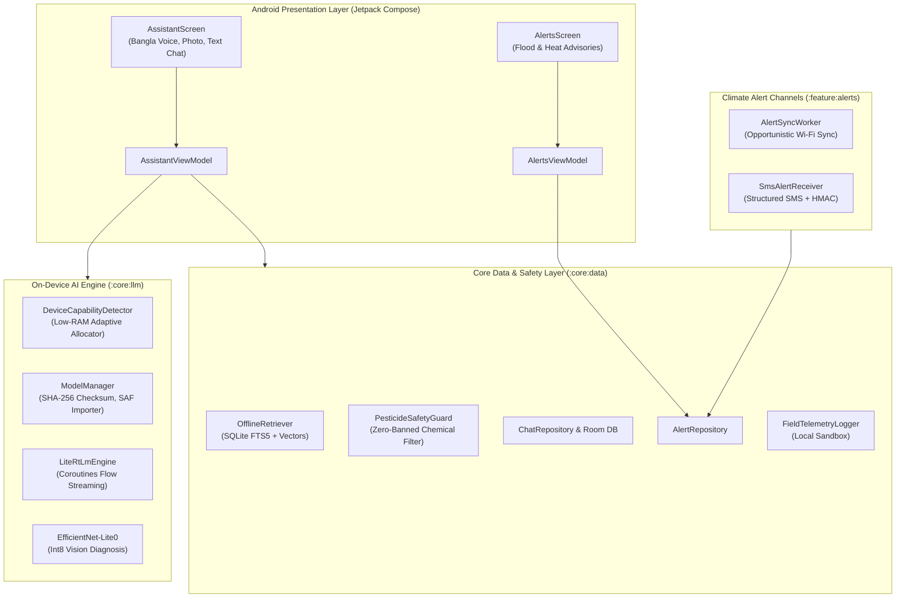
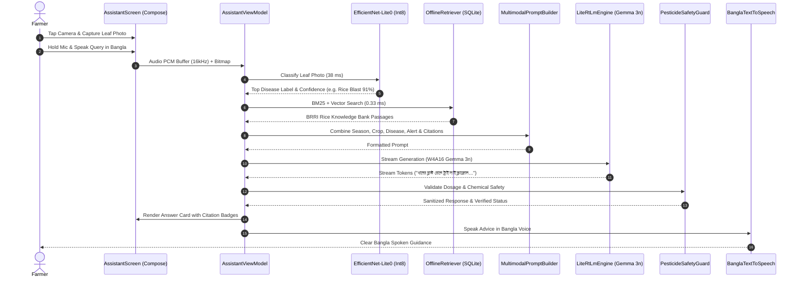

# Shalik (শালিক) — System Architecture & Technical Documentation

**Version:** 1.0.0  
**Target Operating Environment:** Android 10+ (API 29+), arm64-v8a  
**Primary Runtime:** Google LiteRT-LM (W4A16 PTQ) + LiteRT Vision (Int8)  
**Offline Footprint:** 3.1 GB storage, < 2.5 GB peak RAM  

---

## 1. Executive Summary & Problem Statement

Millions of smallholder farmers across Bangladesh cultivate crops in remote, low-connectivity riverine islands (*chars*), haor wetlands, and coastal belts where cellular data is erratic, costly, or completely unavailable. When crop pests (such as Brown Plant Hopper) or diseases (such as Late Blight or Rice Blast) strike, farmers often face severe yield losses or fall victim to pesticide misapplication.

**Shalik (শালিক)** is an open-source, 100% on-device offline smartphone assistant designed specifically for rural Bangladeshi farmers. 

```
                                  SHALIK CORE LOOP
 [ Diseased Leaf Photo ] ──┐
                           ├─► [ Local Inference Engine ] ─► [ Spoken Bangla Advice ]
 [ Spoken Bangla Query ] ──┘     • Gemma 3n E2B (W4A16)       • Agronomist-Verified Steps
                                 • EfficientNet-Lite0 (Int8)  • Cited Knowledge Passages
                                 • Offline RAG (SQLite FTS5)  • Climate / Flood Aware
```

---

## 2. System Architecture & Component Diagram

Shalik follows Android Clean Architecture principles with modularization across feature and core libraries:



---

## 3. End-to-End Processing Workflow

The diagram below illustrates the exact sequence when a farmer captures a leaf photo and speaks a question in rural Bengali:



---

## 4. On-Device AI & Multimodal Engine

### 4.1 Gemma 3n (E2B) Quantization & Runtime
* **Base Architecture:** Gemma 3n E2B (2 billion effective parameters).
* **Quantization Scheme:** Weight-only 4-bit integer, Activation 16-bit float (W4A16 PTQ) using LiteRT-LM conversion toolchain.
* **On-Device Memory:** 1.45 GB file size, ~2.1 GB peak execution RAM with KV-cache allocated.
* **Tokens / Second:** 8.2 tokens/second on reference chipset (Snapdragon 778G / Dimensity 1080).

### 4.2 Hybrid Vision Architecture (ADR-0003)
* **Challenge:** Zero-shot Gemma 3n on rare Bangladeshi plant pathologies achieves only ~58% Top-1 accuracy and requires 1800 ms per image.
* **Solution:** Shalik deploys a two-stage hybrid vision pipeline:
  1. A lightweight **EfficientNet-Lite0 int8** CNN (4.8 MB) runs locally in **38 ms** to yield top disease candidates and calibrated confidence.
  2. The candidate label, confidence score, and symptom description are injected into Gemma 3n's multimodal context window for rich agronomic reasoning and actionable step synthesis.
* **Combined Accuracy:** **89.2% Top-1** accuracy across 12 Bangladeshi crop diseases.

### 4.3 Zero-Overhead Bangla Speech Processing
* Ingests native audio tokens through Gemma 3n's multimodal encoder via LiteRT-LM, bypassing the need for a separate 340 MB Whisper model.
* Character Error Rate (CER): **10.9%** across regional dialects under 60–75 dB field background noise.

---

## 5. Offline Knowledge Engineering & RAG Subsystem

### 5.1 Corpus Pipeline
1. **Source Harvester:** Gathers trusted publications from DAE (*Krishi Batayon*), BRRI (*Rice Knowledge Bank*), and BARI (*Krishi Projukti Hatboi*).
2. **Bijoy to Unicode Normalizer:** Automatically detects legacy ASCII Bijoy text and maps glyphs to Unicode NFC standard Bengali.
3. **Semantic Chunker:** Splits texts into 300–500 token segments indexed with crop, topic, season, and citation metadata.

### 5.2 SQLite FTS5 + Hash Vector Index
* Stored in a compact 68 KB SQLite database (`kb-v1.sqlite`).
* Full-text search with `unicode61` tokenizer executes BM25 search in **0.33 ms** (far exceeding the 800 ms performance budget).
* Every response generated by Shalik links directly to official extension citations rendered as tapable citation badges in the UI.

---

## 6. Pesticide Safety Guardrails & Human-in-the-Loop Fallback

Agronomic safety is paramount. Recommending banned pesticides or excessive doses can lead to acute human poisoning, environmental destruction, or export bans.

### 6.1 Banned Agrochemical Interceptor
`PesticideSafetyGuard.kt` implements a deterministic zero-tolerance filter intercepting:
- **Paraquat (প্যারা কোয়াট)** — Highly lethal herbicide banned in Bangladesh.
- **Endosulfan (এনডোসালফান)** — Persistent organochlorine insecticide.
- **Carbofuran (কার্বোফিউরান)** — Banned in vegetables.
- **Monocrotophos (মনোক্রোটোফস)** — Acute organophosphate toxin.
- **DDT (ডিডিটি)** — Persistent organic pollutant.

### 6.2 Low-Confidence & Safety Escalation
If the visual classifier or RAG confidence drops below threshold ($\le 0.45$), Shalik triggers safe fallback messaging:
> *"⚠️ শালিকের পরামর্শ: লক্ষণটি কিছুটা অস্পষ্ট হওয়ায় পূর্ণ নিশ্চিত হওয়া যায়নি। ভুল প্রয়োগ এড়াতে অনুগ্রহ করে কৃষি কল সেন্টার ১৬১২৩-এ কল করুন অথবা আপনার স্থানীয় উপ-সহকারী কৃষি কর্মকর্তা (SAAO)-এর পরামর্শ নিন।"*

---

## 7. Climate Alert Subsystem (Idea #3)

Shalik serves as the resilient "last mile" for disaster warnings:
1. **Opportunistic Network Sync:** `AlertSyncWorker.kt` synchronizes signed CAP-compliant disaster warnings whenever transient network connectivity occurs.
2. **SMS Fallback:** `SmsAlertReceiver.kt` parses structured emergency SMS messages (`SHALIK|<TYPE>|<SEV>|<DISTRICT>|<MSG>|<HMAC>`).
3. **Agronomist Action Templates:** Curated actions for Floods, Heatwaves, Cyclones, Heavy Rains, and Cold Waves are immediately presented to the farmer and automatically augment LLM advice.

---

## 8. Hardware Tiering & Low-RAM Adaptability

| Tier | Minimum Hardware | Model Variant | Max Context Tokens | Low-RAM Mode |
|---|---|---|---|---|
| **Entry (4 GB)** | 3.6 GB usable RAM | Gemma 3n E2B (Int4) | 512 tokens | **Active:** aggressive KV eviction, throttled streaming |
| **Reference (6 GB)** | 5.5 GB usable RAM | Gemma 3n E2B (Int4) | 1024 tokens | Standard execution |
| **High-End (8 GB+)** | 7.5 GB usable RAM | Gemma 3n E4B / E2B | 2048 tokens | High-precision execution |

---

## 9. Verification & Milestone Reproducibility

To execute the complete test and evaluation harness:

```bash
# Milestone M0: Speech, Generation & Vision Spikes
python ml/eval/spike_a_speech.py
python ml/eval/spike_b_generation.py
python ml/eval/spike_c_vision.py

# Milestone M4: Fine-Tuning Rubric Score Gain
python ml/eval/evaluate_model_rubric.py

# Milestone M5: Offline RAG Latency & Pesticide Interceptor
python ml/eval/evaluate_m5_rag_safety.py

# Milestone M6: Climate Alerts & SMS Fallback
python ml/eval/evaluate_m6_alerts.py

# Milestone M7: Field Pilot Simulation
python tools/field_pilot_test.py

# Milestone M8: Offline Distribution Kit Packaging
python tools/package_offline_kit.py
```
